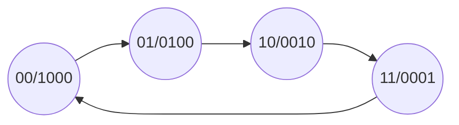
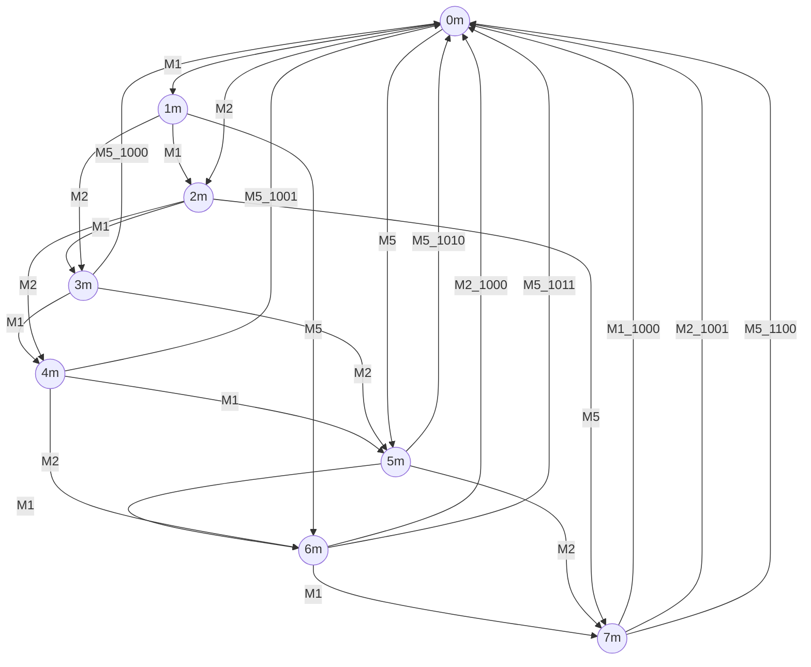

# 数字逻辑电路设计方法

## 语言设计思想和可综合特性

**和C语言不同，$Verilog\ HDL$ 的目标是通过综合工具生成简单的元器件连接关系**

### 1. 可综合程序描述方式

```verilog
//eg.256位计数器
module counter(count, clk, reset);
    output cout;
    input clk, reset;
    reg [7:0] count;
    always @(posedge clk)
        if(!reset) cout <= 0;
    	else if(cout == 8'b11111111) cout <= 0;
    	else cout <= cout + 1;
endmodule
```

### 2. 对电路描述的多样性

+ 结构描述、逻辑代数、真值表、抽象描述


## 组合电路设计

+ **组合电路特点：电路中任意时刻的稳态输出仅仅取决于该时刻的输入，而与电路原来状态无关**

+ 组合电路设计的考虑

  + 所用的逻辑器件数目最少，器件的种类最少，且器件间的连线最简单。这样的电路称为“最小化电路”
  + 为了满足速度要求，应使级数尽量少，以减少门电路的延迟，电路的功耗尽可能小，工作时稳定可靠

+ 描述组合逻辑电路有四种方法：结构描述、逻辑代数、真值表、抽象描述

  + 逻辑代数方式是最简化的描述方式
  + 真值表描述方式是最直观的描述方式
  + 结构描述方式是最复杂的描述方式

  + 抽象性描述从电路功能出发，便于描述大型电路

+ 最后电路综合工具会生成最简化的元器件关系


### 1. 数字加法器

**数字加法器是最常用的一种数字运算逻辑**

#### (1) 1位全加器

1. 利用连续赋值语句

```verilog
module one_bit_fulladder(sum, c_out, a, b, c_in)
	input a, b, c_in;
	output sum, c_out;
    
	assign sum = a ^ b ^ c_in;
	assign c_out = (a & b) | ((a ^ b) & c_in);
endmodule
```

2. 利用行为描述方式

```verilog
module one_bit_fulladder(sum, c_out, a, b, c_in)
	input a, b, c_in;
	output sum, c_out;
    
	assign {c_out, sum} = a + b + c_in;
endmodule
```


#### (2) 8位异步进位加法器

```verilog
module eight_bit_fulladder(sum, c_out, a, b, c_in)
	output [7:0] sum;
	output c_out;
	input [7:0] a, b; 
	input c_in;
	assign {c_out, sum} = a + b + c_in;
endmodule
```


#### (3) 4位超前进位加法器

```verilog
module four_bits_fast_adder(sum_out, c_out, a, b, c_in)
	input [3:0] a, b;
	input c_in;
	output [3:0] sum_out;
	output c_out;
    
	wire [4:0] g, p, c;
    
	assign c[0] = c_in;
	assign p = a | b;
	assign g = a & b;
	assign c[1] = g[0] | (p[0] & c[0]);
	assign c[2] = g[1] | (p[1] & (g[0] | (p[0] & c[0])));
	assign c[3] = g[2] | (p[2] & (g[1] | (p[1] & (g[0] | (p[0] & c[0])))));
	assign c[4] = 
        g[3] | (p[3] & (g[2] | (p[2] & (g[1] | (p[1] & (g[0] | (p[0] & c[0])))))));
	assign sum_out = p ^ c[3:0];
	assign c_out = c[4];
```


### 2. 数据比较器

```verilog
module four_bits_comp1(F, A, B, C);
	parameter comp_width = 4;
	output [2:0] F;
	input [2:0] C;
	input [comp_width - 1:0] A, B;
	reg [2:0] F;
    
	always @(A or B or C)
		if (A > B) F = 3'b100;
		else if (A < B) F = 3'b001;
		else F = C;
endmodule
```


### 3. 数据选择器

#### (1) 真值表形式

```verilog
module MUX(out, data, sel);
	output out;
	input [3:0] data;
	input [1:0] sel;
	reg out;
    
	always @(data or sel)
		case (sel)
			2'b00: out <= data[0];
			2'b01: out <= data[1];
			2'b10: out <= data[2];
			2'b11: out <= data[3];
		endcase
endmodule
```


#### (2) 逻辑表达式形式

```verilog
module MUX(out, data, sel);
	output out;
	input [3:0] data;
	input [1:0] sel;
    
	wire w1, w2, w3, w4;
    
	assign w1 = (~sel[1]) & (~sel[0]) & data[0];
	assign w2 = (~sel[1]) & sel[0] & data[1];
	assign w3 = sel[1] & (~sel[0]) & data[2];
	assign w4 = sel[1] & sel[0] & data[3];
endmodule
```


#### (3) 结构性描述

```verilog
module MUX(out, data, sel)
    output out;
    input [3:0] data;
    input [1:0] sel;
    wire w1, w2, w3, w4, w5, w6;
    
    not	U1(w1, sel[1]),
        U2(w2, sel[0]);
    and U3(w3, w1, w2, data[0]),
        U4(w4, w1, sel[0], data[1]),
        U5(w5, sel[1], w2, data[2]),
        U6(w6, sel[1], sel[0], data[3]);
    or	U7(out, w3, w4, w5, w6);
endmodule
```

**PS：`if-else` 语句与 `?` 操作符实际上就是2选1数据选择器**


### 4. 编码器

**将多根信号线传输的信号压缩成更少的信号线，检测信号的输入**

#### (1) 8-3线编码器

```verilog
module code_8to3(F, I);
    output [2:0] F;
    input [7:0] I;
    reg [2:0] F;
    
    always @(I)
    	begin
            case(I)
                8'b0000_0001: F = 3'b000;
                8'b0000_0010: F = 3'b001;
                8'b0000_0100: F = 3'b010;
                8'b0000_1000: F = 3'b011;
                8'b0001_0000: F = 3'b100;
                8'b0010_0000: F = 3'b101;
                8'b0100_0000: F = 3'b110;
                8'b1000_0000: F = 3'b111;
                default : F = 3'bx;
            endcase
    	end
endmodule
```


#### (2) 8-3线优先编码器

```verilog
module mux8to3_p (data_out, sel, data_in)
    output [2:0] data_out;
    input [7:0] data_in;
    input sel;
    reg [2:0] data_out;
    
    always @(data_in or sel)
        begin
            if(sel)
            	data_out = 3'b111;
            else
                begin
                    casex(data_in)
                        8'b0xxx_xxxx: data_out = 3'b000;
                        8'b10xx_xxxx: data_out = 3'b001;
                        8'b110x_xxxx: data_out = 3'b010;
                        8'b1110_xxxx: data_out = 3'b011;
                        8'b1111_0xxx: data_out = 3'b100;
                        8'b1111_10xx: data_out = 3'b101;
                        8'b1111_110x: data_out = 3'b110;
                        8'b1111_1110: data_out = 3'b111;
                        8'b1111_1111: data_out = 3'b111;
                    endcase
                end
        end
endmodule
```


#### (3) 8421BCD编码器

```verilog
module BCD8421(data_out, data_in);
    output [3:0] data_out;
    input [8:0] data_in;
    reg [3:0] data_out;
    
    always @(data_in)
        begin
            case(data_in)
                9'b0_0000_0000: data_out = 4'b0000;
                9'b0_0000_0001: data_out = 4'b0001;
                9'b0_0000_0010: data_out = 4'b0010;
                9'b0_0000_0100: data_out = 4'b0011;
                9'b0_0000_1000: data_out = 4'b0100;
                9'b0_0001_0000: data_out = 4'b0101;
                9'b0_0010_0000: data_out = 4'b0110;
                9'b0_0100_0000: data_out = 4'b0111;
                9'b0_1000_0000: data_out = 4'b1000;
                9'b1_0000_0000: data_out = 4'b1001;
                default: data_out = 4'b0000;
            endcase
        end
endmodule
```


#### (4) 余3编码器

```verilog
module code_change(B_out, B_in);
    output [3:0] B_out;
    input [3:0] B_in;
    
    assign B_out = B_in + 2'b11;
    
endmodule
```


### 5. 译码器

#### (1) 逻辑表达式

```verilog
module decode_2to4(Y, E, A);
    output [3:0] Y;
    input [1:0] A;
    input E;
    
    assign Y[0] = ~(~E & ~A[1] & ~A[0]);
    assign Y[1] = ~(~E & ~A[1] & A[0]);
    assign Y[2] = ~(~E & A[1] ~A[0]);
    assign Y[3] = ~(~E & A[1] & A[0]);
endmodule    
```


#### (2) 抽象描述

```verilog
module  decode_2to4(Y, E, A);
    output [3:0] Y;
    input [1:0] A;
    input E;
    reg [3:0] Y;
    
    always@(E or A)
        casex({E, A})
            3'b1xx:  Y = 4'b0000;
            3'b000:  Y = 4'b0001;
            3'b001:  Y = 4'b0010;
            3'b010:  Y = 4'b0100;
            3'b011:  Y = 4'b1000;
            default: Y = 4'b0000;
        endcase
endmodule
```


### 6. 奇偶校验器

#### (1) 结构描述

```verilog
module checker_8(Fod, Fev, b);
	output Fod, Fev;
    input [7:0] b;
    wire w1, w2, w3, w4, w5, w6;
    xor U1(w1, b[0], b[1]);
    xor U2(w2, b[2], b[3]);
    xor U3(w3, b[4], b[5]);
    xor U4(w4, b[6], b[7]);
    xor U5(w5, w1, w2);
    xor U6(w6, w3, w4);
    xor U7(Fod, w5, w6);
    not U8(Fev, Fod);
endmodule
```


#### (2) 抽象描述

```verilog
module checker_8(Fod, Fev, b);
	output Fod, Fev;
    input [7:0] b;
    assign Fod = ^b;
    assign Fev = ~Fod;
endmodule
```


## 时序逻辑电路

### 1. 触发器

#### (1) D触发器

```verilog
module DFF(q, clk, data_in);
    output q;
    input clk, data_in;
    reg q;
    always @(posedge clk)
        q <= data_in;
endmodule
```


#### (2) 带复位端的D触发器

##### a. 同步清零

```verilog
module DFF_rst(q, clk, reset, data_in);
    output q;
    input clk, reset, data_in;
    reg q;
    always @(posedge clk)
        if (!reset) q <= 0;
        else q <= data_in;
endmodule
```

##### b. 异步清零

```verilog
module DFF_rst(q, clk, reset, data_in);
    output q;
    input clk, reset, data_in;
    reg q;
    always@(posedge clk or reset)
        if (!reset) q <= 0;
        else q <= data_in;
endmodule
```


#### (3) T触发器

```verilog
module TFF_rst(q, T, clk, reset);
    output q;
    input T, clk, reset;
    reg q;
    always@(posedge clk)
        if (!reset) q <= 1'b0;
    	else if(T) q <= ~q;
endmodule
```


### 2. 计数器

#### (1) 二进制计数器（二分频电路）

```verilog
module count_2(Q, clk, reset);
    output Q;
    input clk, reset;
    reg Q;
    always@(posedge clk or reset)
        if(!reset) 
            Q <= 1'b0;
    	else
            Q <= ~Q;
endmodule
```


#### (2) 任意模值计数器

```verilog
//反馈清零法(十一进制计数器)
module count_11(count, clk, reset);
    output [3:0] count;
    input clk, reset;
    reg [3:0] count;
    always@(posedge clk or reset)
        if(!reset)
            count <= 4'b0000;
    	else
        	if(count == 4'b1010)
        		count <= 4'b0000;
            else
        		count <= count + 1;
endmodule
```


### 3. 移位寄存器

```verilog
//环形移位寄存器
module shiftregist(D, clk, reset);
    parameter shiftregist_width = 4;
    output [shiftregist_width - 1:0] D;
    input clkl, reset;
    reg [shiftregist_width - 1:0] D;
    always@(posedge clk)
        begin
            if(!reset)
                D <= 4'b0000;
            else
                D <= {D[shiftregist_width - 2:0], D[shiftregist_width - 1]};
        end
endmodule
```


### 4. 序列信号发生器

+ 按照序列循环长度 M 与触发器数目 n 的关系， 分为三种

  1. 最大循环长度，$M=2^n$

  2. 最长线性序列码，$M=2^n-1$

  3. 任意循环长度序列码，$M<2^n$

#### (1) 由移位寄存器构成

+ 采用循环移位寄存器
+ 电路工作前将序列码置入移位寄存器

    ```verilog
    //eg. 设计一个产生10011序列的信号发生器
    module signal_maker(out, clk, load, D);
        parameter M = 6;
        output out;
        input clk, load;
        input [M - 1:0] D;
        reg [M - 1:0] Q;
        initial
            Q = 6'b10011;
        always@(posedge clk)
            begin
                if(load)
                    Q <= D;
                else
                    Q <= {Q[M - 2:0], Q[M - 1]};
            end
        assign out = Q[M - 1];
    endmodule
    ```

**该方法用面积换速度（需要更多的移位寄存器，但移位寄存器的速度更快）**


#### (2) 由移位寄存器和组合逻辑电路构成

1. 根据给定序列信号的循环周期 M，确定移位寄存器位数 n​，$2^{n-1}<M\le 2^n$

2. 确定移位寄存器的 M 个独立状态。将给定的序列码按照移位规律每 n 位一组，划分为 M 个状态

3. 根据M个不同的状态列出移位寄存器的态序表和反馈函数表，求出反馈函数表达式

4. 检查自启动功能

5. 反馈型序列信号发生器中的时序状态由移位寄存器产生，输出取寄存器的最高位

```verilog
module signal_maker(out, clk, load, D);
    parameter M = 4;
    output out;
    input clk, load;
    input [M-1:0] D;
    reg [M-1:0] Q;
    wire w1;

    always @(posedge clk)
        if (load) Q <= D;
        else Q <= {Q[M-2:0], w1};
    
    assign w1 = (~Q[3]) | ((~Q[1])&(~Q[0])) | (Q[3]&(~Q[2]));
    assign out = Q[M-1];
endmodule
```

   **该方法节省了移位寄存器的数量，但用组合网络构建反馈输入信号端，而一旦组合网络出现故障，难以自愈合**


#### (3) 由计数器构成

1. 根据序列码的长度M设计M进制计数器，状态可以自定
2. 按计数器的状态转移关系和序列码要求设计组合输出网络
3. 计数型序列信号发生器中，采用计数器代替移位寄存器产生时序状态，输出由组合电路产生

```verilog
module signal_maker(OUT, clk, reset);
    parameter M = 3;
    output OUT;
    input clk, reset;
    reg [M-1:0] counter;
    
    always @(posedge clk)
        if(!reset) counter <= 3'b0000;
    	else counter <= counter + 1;
    assign OUT = 
        counter[2] | ((~counter[1])&(~counter[0])) | ((counter[1]&counter[0]));
endmodule
```

**组合电路对计数器不会产生反馈，因而组合电路的错误不会传播，不容易出现电路故障**


### 5. 伪随机码发生器

```verilog
module signal15(out, clk, load_n, D_load);
    output out;
    input load_n, clk;
    input [3:0] D_load;
    reg [3:0] Q;
    wire F;
    
    always @(posedge clk)
        if(~load_n)	Q = D_load;
    	else Q <= {Q[2:0], F};
    
    assign F = (Q[1]^Q[0]) | (~Q[3]&~Q[2]&~Q[1]&~Q[0]);
    assign out = Q[3];
```


# 有限同步状态机

+ 有限状态机是时序电路的通用模型，任何时序电路都可以表示为有限状态机

+ 有限状态机本质上是由寄存器与组合逻辑构成的时序电路，各个状态之间的转移总是在时钟的触发下进行的，状态信息存储在寄存器中，状态的个数是有限

+ 有限状态机由两部分组成：存储电路和组合逻辑电路

+ 存储电路，用来生产状态机的状态；组合逻辑电路，用来提供输出以供状态机跳转的条件

+ 有限同步状态机分为三大方程：输出方程，状态转移方程，激励方程


### 1. 有限状态机的分类

#### (1) 米利型 ( $Mealy$ )

+ 输出与当前状态和输入有关
+ 延迟由组合逻辑与输入决定


#### (2) 摩尔型 ( $Moore$ )

+ 输出仅依赖当前状态，与输入无关
+ 工作比 $Mealy$ 型快（工作频率高）


### 2. 有限状态机编码方式

+ 二进制编码：状态寄存器由触发器组成
  + 使用的触发器个数少，节省资源
  + 状态跳转时可能有多位同时变化，提升电路功耗，影响电路速度，同时容易引起毛刺，造成逻辑错误

+ 格雷编码
  + 格雷码跳转时只有一位发生变化，减少了产生毛刺和一些暂态的可能，可以处理在临近状态间跳转的过程
  + 面对多种变化情况的时候，也无法很好地处理信号

+ $One\ hot$ 编码：对于n个状态采用n位来编码，每个状态编码中只有一个bit位为1 
  + $One\ hot$ 编码将状态寄存器与状态数一一对应，保证电路的效率速度，同时提高精度
  + $One\ hot$ 编码增加了使用触发器的个数
  + 但是这种编码方便译码，可以有效地节省和化简组合电路


### 3. 描述方式

#### (1) 两段式描述

```verilog
//第一个进程，同步时序模块，格式化描述次态寄存器迁移到现态寄存器
always@(posedge clk or negedge rst_n)  //异步复位
    begin
        if(!rst_n)
            current_state <= IDLE;
        else
            current_state <= next_state;
    end

//第二个进程，组合逻辑模块，描述状态转移条件判断
always@(current_state)  //电平触发
    begin
        next_current = x;		//初始化，使系统复位后能进入正确的状态，不推荐写法
        case(current_state)
            S1:if(...) next_state = S2;
            	out1 <= 1'b1;
            	// 注意阻塞和非阻塞赋值
            ...
        endcase
    end   
```


#### (2) 三段式描述

```verilog
//第一个进程，同步时序模块，格式化描述次态寄存器迁移到现态寄存器
always@(posedge clk or negedge rst_n)
    begin
        if(!rst_n)
            current_state <= IDLE;
        else
            current_state <= next_state;
    end

//第二个进程，组合逻辑模块，描述状态转移条件判断
always@(current_state)
    begin
        next_state = x;
        case(current_state)
            S1:if(...) next_state = S2;
            ...
        endcase
    end

//第三个进程，同步时序模块格式化描述次态寄存器输出
always@(posedge clk or negedge rst_n)
    begin
        ...//初始化
        case(next_state)
            S1: out1 <= 1'b1;
            S2: out2 <= 1'b1;
            default:...;
        endcase
    end
```


### 4. 示例

#### (1) 四状态转移图




```verilog
//eg.两段式
module state4(OUT, clk);
    output [3:0] OUT;
    input clk;
    reg [3:0] OUT;
    reg [1:0] STATE, next_STATE;
    
    always@(STATE)
        case(STATE)
            2'b00:
                begin
                    OUT <= 4'b1000;
                    next_STATE <= 2'b01;
                end
            2'b01:
              	begin
                    OUT <= 4'b0100;
                    next_STATE <= 2'b10;
                end
            2'b10:
                begin
                    OUT <= 4'b0010;
                    next_STATE <= 2'b11;
                end
            2'b11:
                begin
                    OUT <= 4'b0001;
                    next_STATE <= 2'b00;
                end
        endcase
    
    always@(posedge clk)
        STATE <= next_STATE;
endmodule
```


#### (2) 卖报机问题

+ 设计一个自动售报机，报纸价钱为8角，纸币有1角、2角、5角。不考虑投币为大额面值的情况



**画张鬼畜图，证明这题目的 $zz$**