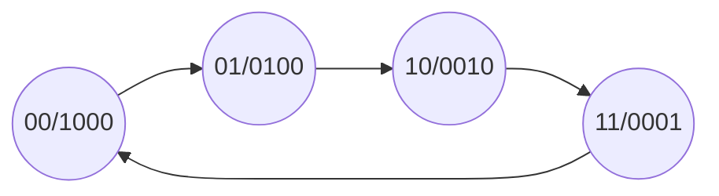
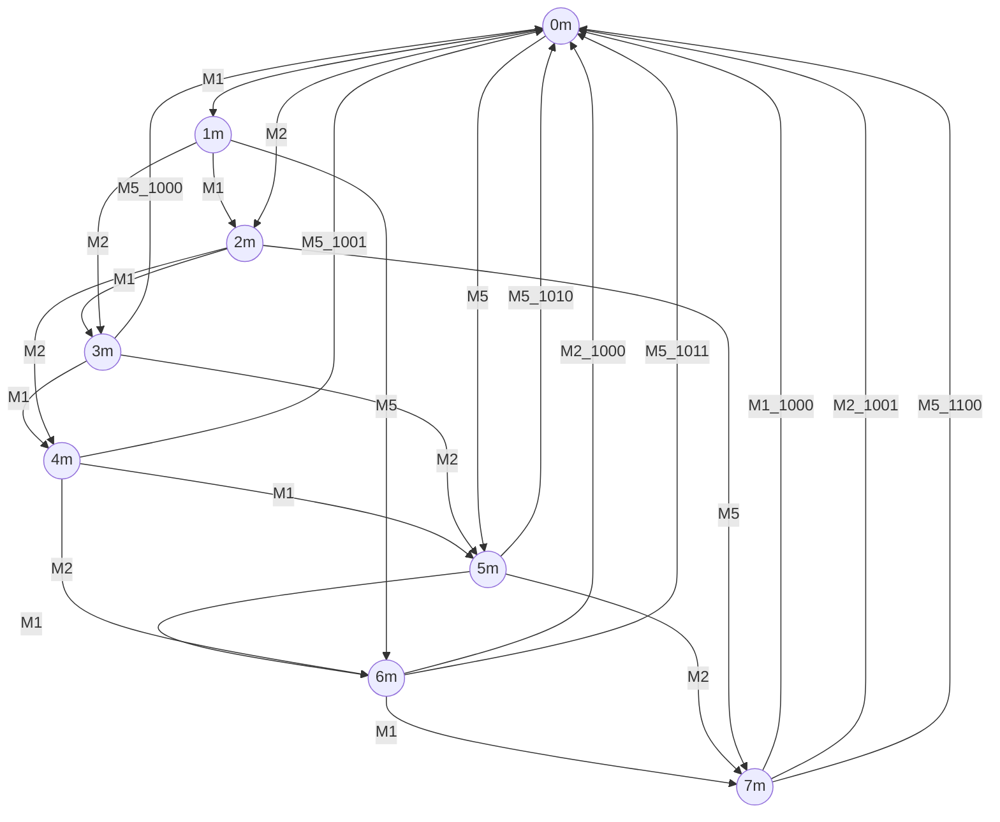

# 有限同步状态机

+ 有限状态机是时序电路的通用模型，任何时序电路都可以表示为有限状态机

+ 有限状态机本质上是由寄存器与组合逻辑构成的时序电路，各个状态之间的转移总是在时钟的触发下进行的，状态信息存储在寄存器中，状态的个数是有限

+ 有限状态机由两部分组成：存储电路和组合逻辑电路

+ 存储电路，用来生产状态机的状态；组合逻辑电路，用来提供输出以供状态机跳转的条件

+ 有限同步状态机分为三大方程：输出方程，状态转移方程，激励方程


### 1. 有限状态机的分类

#### (1) 米利型 ( $Mealy$ )

+ 输出与当前状态和输入有关
+ 延迟由组合逻辑与输入决定


#### (2) 摩尔型 ( $Moore$ )

+ 输出仅依赖当前状态，与输入无关
+ 工作比 $Mealy$ 型快（工作频率高）


### 2. 有限状态机编码方式

+ 二进制编码：状态寄存器由触发器组成
  + 使用的触发器个数少，节省资源
  + 状态跳转时可能有多位同时变化，提升电路功耗，影响电路速度，同时容易引起毛刺，造成逻辑错误

+ 格雷编码
  + 格雷码跳转时只有一位发生变化，减少了产生毛刺和一些暂态的可能，可以处理在临近状态间跳转的过程
  + 面对多种变化情况的时候，也无法很好地处理信号

+ $One\ hot$ 编码：对于n个状态采用n位来编码，每个状态编码中只有一个bit位为1 
  + $One\ hot$ 编码将状态寄存器与状态数一一对应，保证电路的效率速度，同时提高精度
  + $One\ hot$ 编码增加了使用触发器的个数
  + 但是这种编码方便译码，可以有效地节省和化简组合电路


### 3. 描述方式

#### (1) 两段式描述

```verilog
//第一个进程，同步时序模块，格式化描述次态寄存器迁移到现态寄存器
always@(posedge clk or negedge rst_n)  //异步复位
    begin
        if(!rst_n)
            current_state <= IDLE;
        else
            current_state <= next_state;
    end

//第二个进程，组合逻辑模块，描述状态转移条件判断
always@(current_state)  //电平触发
    begin
        next_current = x;		//初始化，使系统复位后能进入正确的状态，不推荐写法
        case(current_state)
            S1:if(...) next_state = S2;
            	out1 <= 1'b1;
            	// 注意阻塞和非阻塞赋值
            ...
        endcase
    end   
```


#### (2) 三段式描述

```verilog
//第一个进程，同步时序模块，格式化描述次态寄存器迁移到现态寄存器
always@(posedge clk or negedge rst_n)
    begin
        if(!rst_n)
            current_state <= IDLE;
        else
            current_state <= next_state;
    end

//第二个进程，组合逻辑模块，描述状态转移条件判断
always@(current_state)
    begin
        next_state = x;
        case(current_state)
            S1:if(...) next_state = S2;
            ...
        endcase
    end

//第三个进程，同步时序模块格式化描述次态寄存器输出
always@(posedge clk or negedge rst_n)
    begin
        ...//初始化
        case(next_state)
            S1: out1 <= 1'b1;
            S2: out2 <= 1'b1;
            default:...;
        endcase
    end
```


### 4. 示例

#### (1) 四状态转移图




```verilog
//eg.两段式
module state4(OUT, clk);
    output [3:0] OUT;
    input clk;
    reg [3:0] OUT;
    reg [1:0] STATE, next_STATE;
    
    always@(STATE)
        case(STATE)
            2'b00:
                begin
                    OUT <= 4'b1000;
                    next_STATE <= 2'b01;
                end
            2'b01:
              	begin
                    OUT <= 4'b0100;
                    next_STATE <= 2'b10;
                end
            2'b10:
                begin
                    OUT <= 4'b0010;
                    next_STATE <= 2'b11;
                end
            2'b11:
                begin
                    OUT <= 4'b0001;
                    next_STATE <= 2'b00;
                end
        endcase
    
    always@(posedge clk)
        STATE <= next_STATE;
endmodule
```


#### (2) 卖报机问题

+ 设计一个自动售报机，报纸价钱为8角，纸币有1角、2角、5角。不考虑投币为大额面值的情况



**画张鬼畜图，证明这题目的 $zz$**