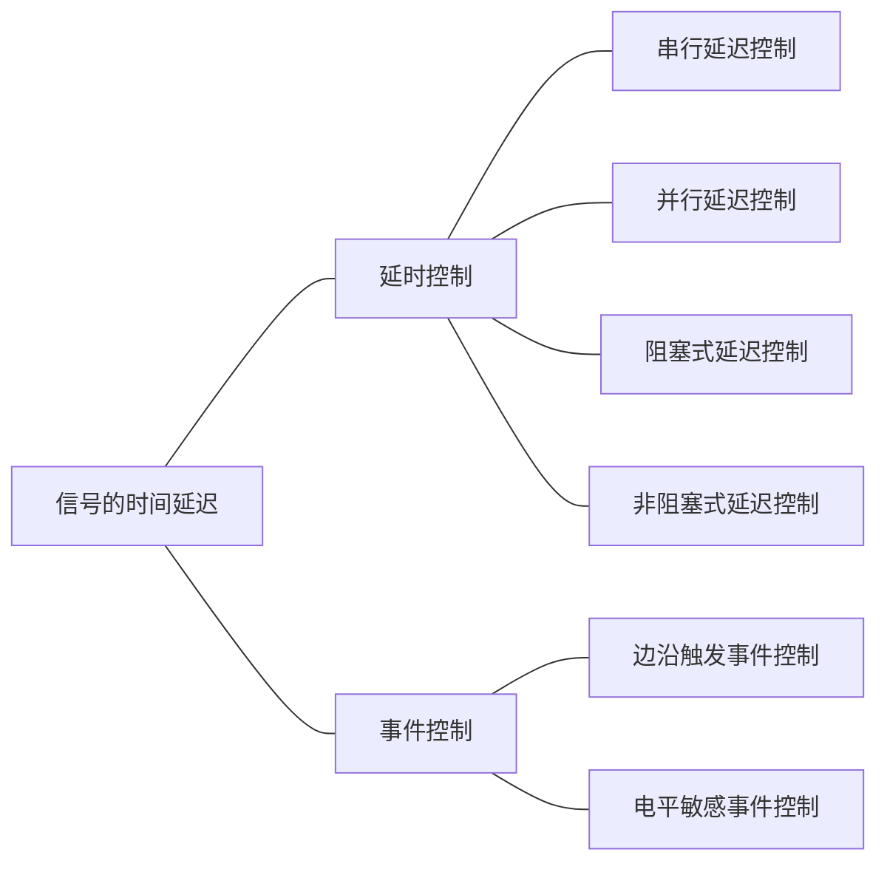

# 测试程序设计基础

## 与仿真相关的系统任务

### 1. `$display` 和 `$write`

+ `$display`
  + `$display("<format_specifiers>", <signal, signal2, ..., signaln>);`
  + `$display` 将待定信息输出后会自动换行

+ `$write`

  + `$write("<format_specifiers>", <signal, signal2, ..., signaln>);`

  + `$write` 将待定信息输出后不会自动换行

+ 输出格式说明由"%"和格式字符组成，其作用是将输出的数据转换成指定的格式输出

```verilog
module display_tb;
    reg [15:0] rval;
    pulldown(pd);
    
    initial begin
        rval = 101;
        $display(" \\\t%% \"\123 ");					//\ %"S
        $display("rval = %hhex %ddecimal", rval, rval);	//rval = 0065hex 101decimal
        $write("simulation time is");
        $write("%t\n", $time);							//simulation time is 0
    end
endmodule
```


### 2. `$monitor` 和 `$strobe`

+ `$monitor` 
  + `$monitor("<format_specifiers>", <signal, signal2, ... , signaln>);`
  + `$monitor` 输出控制和输出列表规则与 `$display` 相同
  + `$monitor` 当参数列表中变量或表达式的值发生变化时，整个参数列表中变量或表达式的值才输出显示
  + `$monitoron` 和 `$monitoroff` 可以通过打开和关闭监控标志来控制任务 \$monitor 的启动和停止

  + 通常在通过调用 `$monitoron` 启动 `$monitor` 时，总是立刻输出显示当前时刻参数列表中的值

  ```verilog
  module monitor_tb;
      integer a, b;
      initial begin
          a = 2;
          b = 4;
          forever begin
              #5 a = a + b;
              #5 b = a - 1;
          end
      end
      
      initial #40 $ finish;
      
      initial begin
          #10 $monitoron;
          $monitor($time, "a = %d, b = %d", a, b);
          #20 $monitoroff;
  	end
  endmodule
  ```

  

+ `$strobe` 

  + `$strobe(<functions_or_signals>);`
  + `$strobe("<string_and/or_variables>", <functions_or_signals>);`
  + `$strobe` 任务在被调用时刻所有的赋值语句都完成后，才输出相应的文字信息

  + `$strobe`：十进制

    `$strobeb`：二进制

    `$strobeo`：八进制

    `$strobeh`：十六进制

  ```verilog
  module strobe_tb;
      reg a,b;
      initial begin
          a = 0;
          $display("a by display is: ", a);		//0
          $strobe("a by strobe is: ", a);			//1
          a = 1;
      end
      
      initial begin
          b <= 0;
          $display("b by display is: ", b);		//x
          $strobe ("b by strobe is: ", b);		//0
          #5;
          $display("#5 b by display is: ", b);	//0
          $display("#5 b by strobe is: ", b);		//1
          b <= 1;
      end
  endmodule
  ```

  

### 3. `$time` 和 `$realtime`

+ 系统函数 `$time` 返回64位整数表示当前的仿真时刻值

+ `$realtime` 返回实数型数据，很少用

```verilog
`timescale 1ns/1ns			//时钟采样频率
module time_tb;
    reg ts;
    parameter delay = 2;
    
    initial begin
        #delay ts = 1;
        #delay ts = 0;
        #delay ts = 1;
        #delay ts = 0;
	end

    initial $monitor($time,"ts = %b", ts);
endmodule
```


### 4. `$finish` 和 `$stop`

**`$finish` 会退出仿真器，结束仿真；`$stop` 只是暂停仿真，可以通过命令提示符，继续仿真**

+ 语法格式：

  + `$finish;`

  + `$finish(n);`
  + `$stop;`
  + `$stop(n);`

| n 的取值 |                         含义                         |
| :------: | :--------------------------------------------------: |
|    0     |                    不输出任何信息                    |
|    1     |                  给出仿真时间和位置                  |
|    2     | 给出仿真时间和位置，还有所用 memory 及 CPU时间的统计 |


### 5. `$readmemh` 和 `$readmemb`

**`$readmem` 和 `$readmemb` 用来从文件中读取数据到存储器中，可在仿真的任何时刻被执行调用**

+ 语法格式：

  + `$readmemb("<file_name>", <memory_name>);`

  + `$readmemb("<file_name>", <memory_name>, <start_addr>);`

  + `$readmemb("<file_name>", <memory_name>, <start_addr>, <finish_addr>);`

+ 现在不常用


### 6. `$random`

+ `$random` 是产生随机数的系统函数，每次调用将返回一个32位的带符号整型随机数

+ 语法格式：`$random%<number>`

+ 用法：`$random%<b>` 会给出一个范围在`(-b+1, b-1)`之间的随机数


## 信号时间赋值语句



### 1. 时间延迟的语法说明

#### (1) 语法格式：

+ `#<延迟时间> 行为语句;`
+ `#<延迟时间>`


#### (2) 时间控制方式

+ 外部时间控制方式：时间控制出现在整个过程赋值语句的最左端

    ```verilog
    initial begin
        #5 a = b;
    end
    ```

    等价于

    ```verilog
    initial begin
        #5; 
        a = b;
    end
    ```

+ 内部时间控制方式：过程赋值语句中的时间控制部分出现在赋值操作符和赋值表达式之间的时间控制方式

  ```verilog
  initial
      begin
  		a = #5 b;
      end
  ```

  等价于

  ```verilog
  initial
      begin
          temp = b;
          #5;
          a = temp;
      end
  ```

  